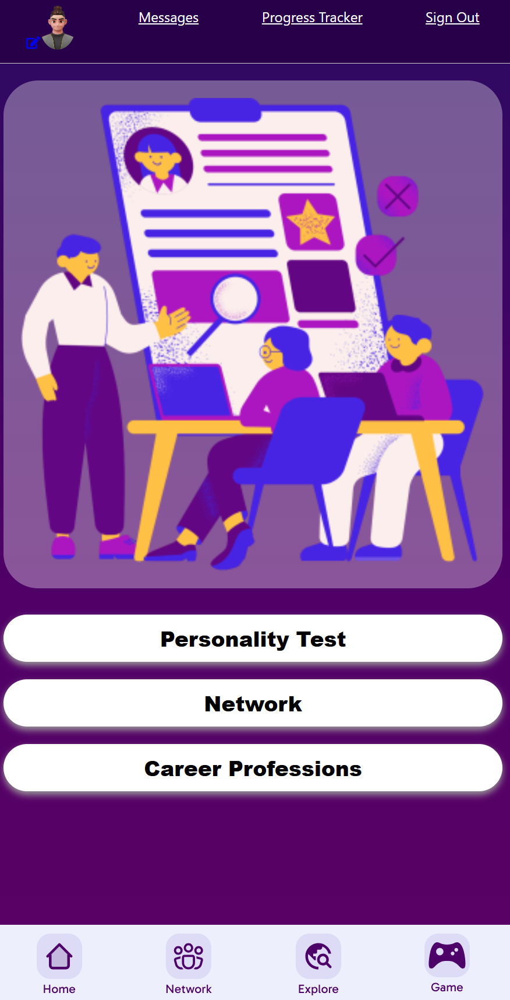

# DiscoverU Application

#### An application for exploring your career interests

## Description
DiscoverU is an interactive web application designed to help users explore different career paths and connect with others on a similar journey. Whether you're just starting out or considering a career change, DiscoverU provides an engaging way to learn more about various professions through interactive content.

The planning phase of DiscoverU included close collaboration with a UI/UX design team from a parallel course. This was the first time both teams had worked cross-functionally, which presented a unique set of challenges and learning opportunities. The design team created the visual layout and user flow, then handed the assets off to our development team to bring the vision to life. Despite the challenges of bridging two different workflows and communication styles, the experience proved to be both a rewarding challenge and a fun, collaborative effort that pushed everyone to grow.

## Table of Contents
* [Technologies Used](#technologiesused)
* [Features](#features)
* [Design](#design)
* [Project Next Steps](#nextsteps)
* [Deployed App](#deployment)
* [Meet The Teams](#devs)

## Technologies Used 
* JavaScript
* HTML5
* CSS3
* mongoose 
* react 
* react-router
* react-dom
* dotenv
* bcrypt
* express
* express-session
* method-override
* morgan 
* cors 
* jsonwebtoken
* Figma

## Features
* User Authentication
* Database storage
* Navigation bar 
* Buttons for submission of forms
* Avatars 
* Edit functionality for user account information
* Community and Network Page
* Reels/Explore Page
* Custom Fonts
* Carousel for images on explore page
* Youtube videos embed

## Wireframe Link
* https://www.figma.com/design/VkXjYrgsTe36YHAAoKxpEi/DiscoverU-Design?node-id=396-9111&p=f&t=FjP6VM7fkTXZGJtO-0
## Trello Planning
* https://trello.com/b/U6EZfqkC/discoveru-final-project

## Design
* The concept for DiscoverU originated from a group of students who wanted to create a platform that could help people navigate career choices in an engaging and interactive way. The initial idea was centered around making career exploration less overwhelming and more fun—something that could give users a sense of real-world experience through interactive learning and peer connection.

Once the idea was established, it was brought to life visually by our amazing and dedicated UI/UX design team. They took the original concept and transformed it into a structured, user-centered design. Through user research, wireframes, and iterative feedback, the design team developed a polished interface that balanced both function and creativity. Their final design laid the foundation for our development team to build a visually engaging application aligned with the original vision.

This collaborative process between idea creators, designers, and developers helped shape DiscoverU into a project rooted in shared goals, creative exploration, and thoughtful user experience. Looking ahead, there are plans to expand the design across the entire application. Each page will eventually be fully styled with consistent layouts, refined visual elements, and an enhanced user experience. The goal is to ensure every section of DiscoverU reflects the same level of thoughtfulness and creativity established in the initial design phase.

## Project Next Steps
#### List of Future Features
* Further expansion of the DiscoverU 'game'
* Inclusion of Dixie - an AI assistant for the application
* Further expansion of the networking features. Allowing users to follow one another and message each other in real time
* Expansion of the user design. Currently users information is focused towards students or someone not in one of these professions. We would like to allow users established within their fields to be able to proudly showcase their titles and accomplishments. 
* Adding styling to better fit the mobile-first design. Landscape mode for example.
* Add multiple lighting modes (light/dark etc.)

## Github repository
* You can view the front-end repository:
[Github.com](https://github.com/dallas-vanwyk/DiscoverU-front-end)
* If unable to view please go live locally through VS Code
* You can view the back-end repository: 
[Github.com](https://github.com/dallas-vanwyk/DiscoverU-back-end)
* If unable to view please go live locally through VS Code
* You can view the app deployed live here:
[DiscoverU](https://discoveru.netlify.app/)

## <a name="devs">The Dev Team Behind DiscoverU</a>
* Zebastian [GitHub](https://github.com/Zebyrod) [LinkedIn](https://www.linkedin.com/in/zebastian-rodriguez-480191309/)
* Dallas [GitHub](https://github.com/dallas-vanwyk) [LinkedIn](https://www.linkedin.com/in/dallas-van-wyk-5a330676/)
* James [GitHub](https://github.com/JameseyBoy615) [LinkedIn](https://www.linkedin.com/in/james-palumbo-8752a2361/)

DiscoverU was brought to life by a team of three passionate developers who came together with a shared vision: to create a meaningful and interactive platform that helps users explore their future. What started as an idea quickly became a collaborative effort grounded in teamwork, communication, and a willingness to take on new challenges.

Each member of the team brought unique strengths to the table. We divided responsibilities based on individual skill sets and project needs—ranging from front-end development and user authentication to backend integration and UI implementation. Through standups, code reviews, and ongoing support, we ensured consistent progress and a strong team dynamic from start to finish.

This project proved to be more challenging than we initially anticipated—especially when it came to styling. For all three of us, CSS was an area we recognized as a weaker point going in. However, by leaning on one another, sharing techniques, and working through frustrations together, we each pushed past our comfort zones and made real progress. What once felt like a barrier became an opportunity for growth, and we’re proud of the progress we made both as individual developers and as a team. This project represents not only our technical growth but also the power of collaboration. We're proud of what we’ve built together and excited for what’s next.

## <a name="designers">The Design Team Behind DiscoverU</a>
* Diana [LinkedIn](https://www.linkedin.com/in/diana-madden/)
* Will [LinkedIn](https://www.linkedin.com/in/william-speights-6a1b9814/?utm_source=share&utm_campaign=share_via&utm_content=profile&utm_medium=android_app)
* Michele [LinkedIn](http://linkedin.com/in/mibanibo)

The visual identity and user experience of DiscoverU were brought to life by our talented team of UI/UX designers who played a central role in the project's development. From the early stages, the design team spearheaded communication with the student group that conceptualized the app, working to understand the vision and translate it into a clear, engaging user interface.

Using Figma, the design team created wireframes, user flows, and high-fidelity mockups that served as the foundation for the development work that followed. Their designs balanced clarity with creativity, making it easier for users to navigate the app and immerse themselves in the career exploration experience.

This project also marked the design team's first time working cross-functionally with developers—a new dynamic that introduced a fresh set of challenges and learning opportunities. Adapting their process to account for handoff workflows, technical feasibility, and real-time collaboration pushed them to grow as designers and communicators. Their flexibility, problem-solving, and commitment were essential to the success of the project.

The DiscoverU design wouldn’t be what it is without their vision, adaptability, and thoughtful attention to detail.

## Works Cited:

* Carousel: 
A Carousel is a user interface component that allows users to scroll through a collection of items—such as images, cards, or videos—one at a time within a limited space. It's commonly used to present content in a clean, organized, and interactive way without overwhelming the layout.
In DiscoverU, we built a Carousel using React for the Explore page. This section was designed to function like a reels feed, featuring embedded videos that users could swipe or click through horizontally. Each slide in the carousel presented a different video related to various career paths, giving users a dynamic and visually engaging way to discover new professions and insights.
- https://www.npmjs.com/package/react-multi-carousel
* Youtube Embed
To bring real-world insight and visual storytelling to the Explore page, we embedded YouTube videos directly into the app. These videos were featured inside a carousel to create a reels-style feed where users could swipe through and watch content related to different careers.
Using embedded YouTube players allowed us to showcase diverse perspectives—from day-in-the-life videos to career advice—without hosting or managing large video files ourselves. This approach kept the app lightweight while providing a rich, multimedia experience that helped users engage with career content in a modern and familiar format.
- https://www.npmjs.com/package/react-lite-youtube-embed
* Scroll to top functionality when swapping pages
To improve user experience and navigation flow, DiscoverU includes a Scroll to Top feature that automatically scrolls the page to the top whenever a user navigates to a new route.
This functionality ensures that users always start at the top of each page, rather than remaining at their previous scroll position. It’s a small but important detail that helps keep navigation smooth, especially in a multi-page application with long or scrollable content. The feature was implemented using React, and it plays a key role in maintaining a consistent and polished browsing experience throughout the app.
- https://medium.com/@caden0002/fixing-scroll-position-issues-in-react-router-scroll-to-top-on-navigation-86bcfbdfc9db
* Custom Font
To give DiscoverU a unique and polished visual identity, we integrated a custom Google Font called Post No Bills Colombo. This serif display font adds a bold, elegant feel to the application, helping to set the tone and personality of the brand.
Incorporating this custom font not only enhanced the aesthetic appeal of the app but also contributed to a more cohesive and intentional user experience. The font was imported directly from Google Fonts and applied to key elements throughout the interface using CSS, ensuring consistent styling across all pages.
- https://fonts.google.com/specimen/Stick+No+Bills
* Json Web Token
For this application we ran across some issues with the username and avatar staying visible across multiple pages. In order to solve this we had to include them within our authentication method. As we authenticated we were sending the user password and name, but not this additional data causing the user to still be signed in, but not reflected on the front-end page. This meant we had to not only send the user token, but this additonal user data within our routes to ensure the user data did not magically change upon a new page being loaded. 
- https://auth0.com/docs/secure/security-guidance/data-security/token-storage
- https://developer.mozilla.org/en-US/docs/Web/API/Window/storage_event
- https://cheatsheetseries.owasp.org/cheatsheets/HTML5_Security_Cheat_Sheet.html#local-storage
- https://datatracker.ietf.org/doc/html/rfc7519#section-4.1

